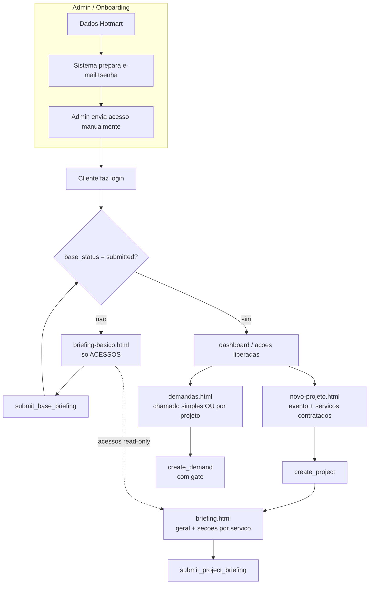

# Briefing em 2 Níveis + Chamados por Projeto — Design

**Spec:** `docs/specs/briefing-base-projeto/spec.md`
**Context:** `docs/specs/briefing-base-projeto/context.md`
**Status:** Draft (aguardando aprovação para Tasks)

---

## Architecture Overview

Dois níveis de dados + um "gate" no meio. O Briefing Básico (acessos, 1 linha por cliente) trava a
criação de projetos/chamados até ser enviado. O Projeto passa a ser **um evento multi-serviço**: um
bloco geral + seções de campanha só dos serviços contratados, com os acessos herdados do Básico.



---

## Data Models

### Novo: `portal.client_briefing` (o Básico / gate)

Uma linha por cliente. Guarda os acessos de todos os serviços.

```sql
portal.client_briefing
  client_slug    text PRIMARY KEY REFERENCES portal.clients(slug) ON DELETE CASCADE
  access         jsonb       NOT NULL DEFAULT '{}'   -- { trafego:{...}, paginas:{...}, automacao:{...}, edicao:{...} }
  base_status    text        NOT NULL DEFAULT 'draft' CHECK (base_status IN ('draft','submitted'))
  submitted_at   timestamptz
  pending_flags  jsonb       NOT NULL DEFAULT '[]'   -- ["trafego.gtm","trafego.tracking_sheet"] (campos "nao tenho")
  created_at     timestamptz NOT NULL DEFAULT now()
  updated_at     timestamptz NOT NULL DEFAULT now()
```

- **Gate:** `base_status = 'submitted'`.
- `pending_flags`: itens "não tenho" (GTM/Planilha/ferramenta ausente) → sinalizados ao operador, não travam.
- Dados pessoais **não** ficam aqui — vêm de `portal.users`/`portal.clients` (read-only no front).

### Alterado: `portal.projects` (vira EVENTO multi-serviço)

```sql
-- migration 031, sobre a estrutura de 029
ALTER TABLE portal.projects
  ADD COLUMN services text[] NOT NULL DEFAULT '{}';   -- serviços incluídos neste evento
  -- briefing jsonb passa a ter o shape { general: {...}, services: { <svc>: {...} } }

-- service_type (single, de 029) vira LEGADO: manter coluna nullable para retrocompat,
-- parar de exigir/usar. Novos projetos gravam services[] + briefing.general.
ALTER TABLE portal.projects ALTER COLUMN service_type DROP NOT NULL;
ALTER TABLE portal.projects DROP CONSTRAINT IF EXISTS projects_service_type_check;
```

**Shape do `briefing` (projeto):**
```json
{
  "general": {
    "event_name": "Seminário Tributário Jun/26",
    "event_date": "2026-06-15",
    "traffic_start": "2026-05-20",
    "total_budget": 15000,
    "traffic_goal": "...", "project_goal": "...",
    "audience": "...", "desired_domain": "..."
  },
  "services": {
    "anuncios_pagos": { "total_budget": 15000, "creatives_qty": 12, "mql_tracking": true, ... },
    "paginas":        { "event_domain": "...", "subdomain": "..." }
  }
}
```

`services[]` lista quais serviços entram no evento (snapshot dos contratados na criação; editável).
As seções renderizadas = interseção de `services[]` com os serviços contratados ativos do cliente.

### Alterado: `briefing-templates.js`

- Cada campo ganha **`scope: 'base' | 'project'`** (acesso fixo vs campanha).
- Split de `web_design_automacao` → **`paginas`** + **`automacao`**.
- Serviços ativos: `anuncios_pagos`, `edicao_video`, `paginas`, `automacao`.
  `design_grafico` e `social_media` ficam no arquivo mas **fora de `ACTIVE_SERVICES`** (ocultos).
- Novo bloco **`GENERAL_PROJECT_FIELDS`** (transversal do evento, não por serviço).
- Helpers novos:
  - `getBaseFields(service)` → campos `scope==='base'`
  - `getProjectFields(service)` → campos `scope==='project'`
  - `getGeneralFields()` → bloco geral do evento
  - `validateBase(access)` / `validateProjectBriefing(services, briefing)` → checam `red` por escopo

---

## Code Reuse Analysis

| Componente | Local | Como usar |
|---|---|---|
| Wizard de briefing | `portal/briefing.html` | Estender: para projeto, renderizar bloco geral + seções `project` dos serviços contratados; acessos read-only herdados |
| Estrutura de template | `portal/assets/briefing-templates.js` | Estender com `scope`, split paginas/automacao, bloco geral |
| Wrapper do cliente | `portal/assets/portal-api.js` | Adicionar `getClientBriefing`, `saveBaseBriefing`, `submitBaseBriefing`, novo `createProject`, `saveProjectBriefing`, `submitProjectBriefing`; ajustar `createDemand` |
| RPCs de briefing | migration 029 (`save_briefing_draft`, `submit_briefing`) | Renomear/reimplementar para projeto-evento; criar equivalentes do Base |
| `get_my_dashboard` | RPC existente | Fonte dos **serviços contratados** do cliente (para filtrar seções) |
| Guard do cliente | `portal/assets/portal-api.js` `requireClient` + `auth-guard.js` | Adicionar verificação do gate (base submetido) |
| Lista de projetos | `portal/projetos.html` | Ajustar para listar eventos multi-serviço + progresso |
| Modal nova demanda | `portal/demandas.html` | Adicionar seleção simples vs por-projeto + gate |

### Integration Points

| Sistema | Integração |
|---|---|
| `portal.services` / `get_my_dashboard` | Define quais seções de serviço aparecem no projeto e no Base |
| `portal.demands.project_id` (já existe, 029) | Liga chamado ao evento |
| `portal.audit_log` | Eventos: `base_submitted`, `project_created`, `project_briefing_submitted` |
| Supabase Auth + `portal.users` | Dados pessoais read-only no Base |

---

## RPCs (migration 031)

| RPC | Assinatura | Faz |
|---|---|---|
| `get_client_briefing()` | — | Retorna a linha de `client_briefing` do chamador (cria vazia on-the-fly se faltar) |
| `save_base_briefing(p_access jsonb, p_pending jsonb)` | merge | Upsert + `access = access || p_access`; só dono; bloqueia se não-dono |
| `submit_base_briefing()` | — | Valida acesso não-vazio → `base_status='submitted'`, `submitted_at=now()`; audit |
| `client_base_ready(p_slug text)` | → boolean | Helper de gate (base submetido?) |
| `create_project(p_title text, p_general jsonb, p_services text[])` | nova sig | **Gate**: exige base submetido. Cria evento; valida que `p_services` ⊆ contratados |
| `save_project_briefing(p_project_id uuid, p_answers jsonb)` | merge | Merge profundo em `briefing` (general + services); só dono enquanto draft |
| `submit_project_briefing(p_project_id uuid)` | — | Valida `red` dos serviços do evento → `status='active'`, `briefing_status='submitted'`; audit |
| `create_demand(...)` | ajuste | **Gate** + reconciliar assinatura (ver Concerns) |

> A RPC antiga `create_project(p_title, p_service_type)` (029) é **substituída** (DROP + CREATE).
> `save_briefing_draft`/`submit_briefing` (029) são substituídas por `save_project_briefing`/`submit_project_briefing`.

### RLS — `portal.client_briefing`

```sql
ALTER TABLE portal.client_briefing ENABLE ROW LEVEL SECURITY;
-- SELECT: dono (client_slug), admin, ou operador via team_assignments (read-only)
-- INSERT/UPDATE: dono (via RPC SECURITY DEFINER) e admin
```
Mesmo padrão das policies de `projects` em 029 (reusar a lógica de `team_assignments`/`is_admin()`).

---

## Components (frontend)

### `portal/briefing-basico.html` (novo)
- **Propósito:** formulário do Briefing Básico (só acessos).
- **Conteúdo:** dados pessoais read-only (de `getMe`) + seções de acesso (`getBaseFields`) dos serviços
  **contratados**; badges 🔴/🟡/🟢; opção "não tenho" → `pending_flags`.
- **Backend:** `getClientBriefing`, `saveBaseBriefing` (autosave debounce), `submitBaseBriefing`.
- **Reusa:** estilos e mecânica de campos do `briefing.html`.

### `portal/briefing.html` (alterado)
- Para **projeto**: renderiza `getGeneralFields()` + `getProjectFields()` por serviço contratado do
  evento; exibe acessos herdados **read-only** (de `getClientBriefing`).
- Mantém o caminho de **demanda** (briefing por demanda) intacto.

### `portal/novo-projeto.html` (alterado)
- De "escolher 1 serviço" → "criar evento": título + bloco geral; serviços derivados dos contratados
  (mostrados para conferência). Chama `create_project(title, general, services)`.

### `portal/projetos.html` (alterado)
- Lista eventos; progresso = % de `red` preenchidos no geral + seções dos serviços do evento.

### `portal/dashboard.html` (alterado)
- **Gate banner** se base não enviado (CTA → `briefing-basico.html`), bloqueando "Novo Projeto/Chamado".
- **DASH-01:** remover botão "Mandar mensagem" da lista de equipe + texto "Fale com sua equipe".

### `portal/demandas.html` (alterado)
- Modal "Novo Chamado": toggle **simples** vs **por projeto** (dropdown de eventos ativos). Gate.

### `portal/assets/portal-api.js` (alterado)
- Novos wrappers (ver tabela RPC) + verificação de gate em `requireClient` (flag `baseReady`).

---

## Error Handling Strategy

| Cenário | Tratamento | Impacto p/ usuário |
|---|---|---|
| Cliente sem base tenta criar projeto/chamado | RPC `RAISE EXCEPTION` + guard no front | Banner "Complete o Briefing Básico primeiro" |
| Campo 🔴 de acesso vazio no submit | `validateBase` no front + check no RPC | Botão "Enviar" desabilitado; destaque do campo |
| "Não tenho GTM/Planilha" | grava em `pending_flags`, não trava | Envio liberado; operador vê pendência |
| Serviço não contratado no `p_services` | RPC rejeita (`services ⊆ contratados`) | Seção não aparece; erro se forçado |
| Editar base após enviado | permitido (acessos mudam); gate segue liberado | Salva normalmente |
| Projeto cancelado com chamado vinculado | `project_id → NULL` (ON DELETE SET NULL, já existe) | Chamado vira avulso |

---

## Tech Decisions (não-óbvias)

| Decisão | Escolha | Porquê |
|---|---|---|
| Base como tabela separada | `portal.client_briefing` (1/cliente) | Separação limpa acesso×campanha; gate simples |
| Herança de acessos | Por **referência** (lê do Base ao abrir projeto) | Acesso atualizado reflete em todos os eventos |
| `service_type` legado em projects | Manter nullable, parar de usar | Evita migração destrutiva de dados existentes |
| Serviços do evento | `services text[]` (snapshot editável) | Permite evento sem todos os serviços; flexível |
| Templates em JS (não no banco) | Mantido | Versionável em git; fora de escopo editar via UI |
| design_grafico/social_media | Ocultos via `ACTIVE_SERVICES` (não removidos) | Reaproveitar depois sem reescrever |

---

## Concerns / Riscos a tratar

1. **Divergência `create_demand`:** `portal-api.js` envia `p_service_type`, mas 029 redefiniu para
   `p_project_id`. A migration 031 deve fixar **uma** assinatura canônica e o front alinhar. Verificar
   se há migração posterior à 029 ativa em produção antes de dropar.
2. **Dados legados em `projects.briefing`:** projetos antigos têm shape antigo (sem `general/services`).
   A migration faz transform best-effort: `briefing := jsonb_build_object('general','{}','services',
   jsonb_build_object(service_type, briefing))` e `services := ARRAY[service_type]`. Volume baixo.
3. **Cache LiteSpeed:** após deploy, purgar cache (novos arquivos/JS) — runbook do projeto.
4. **`ACTIVE_SERVICES` vs dados existentes:** se algum cliente tem serviço `web_design_automacao`
   antigo, mapear para `paginas`+`automacao` no transform.

---

## Próximo passo

Aprovado o design → quebrar em **Tasks** (migration 031, templates, RPCs, cada tela), com dependências
e critério de verificação por task. O item **DASH-01** (remover chat da equipe) pode sair antes, como
quick task isolada, por não depender do resto.
